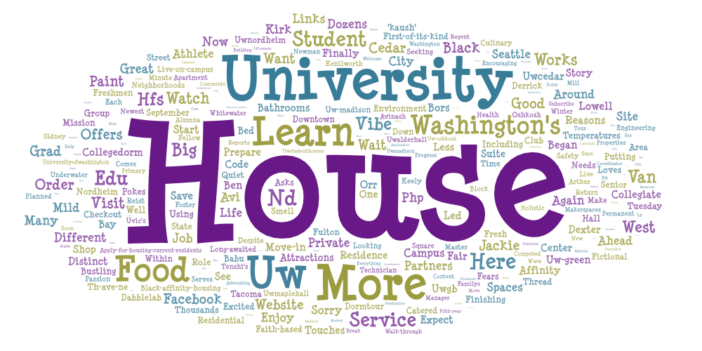
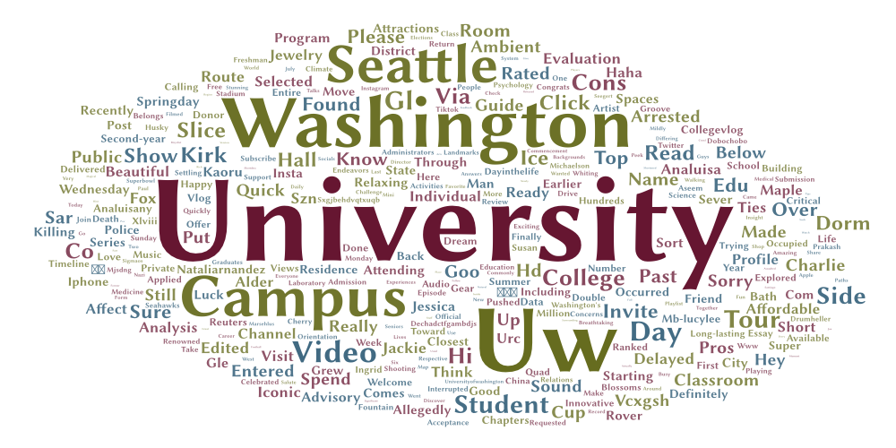

## Topic and Search Parameters

This project looks at how people talk about the University of Washington on YouTube. 
Using the YouTube crawler in Google Colab, I collected video data related to UW.

The search terms used were:
- "uw seattle"
- "uw housing"

These search terms were used to collect video titles, descriptions, and metadata from YouTube.
## Why I Made This Comparison

I wanted to compare the extent to how various topics related to the University of Washington are represented differently on YouTube.
If there were distinct conversations, themes and subject areas within the videos about general UW content versus UW housing content, I expected to identify those.
## Word Cloud Comparison

The word clouds represent the frequency of the most common words that are included in the video descriptions. For example, the UW Seattle word cloud illustrates that the most common words are associated with campus life, students and university related activities. 
On the other hand, the UW Housing word cloud demonstrates that the most common words are associated with apartments, renting, options for housing and student living. Although both word clouds reference students and the university; the housing-focused videos emphasize practical information regarding where and how to live near campus.
## Possible Reasons for the Patterns

It appears as though the type of video that is produced as a result of the search terms results in differing content. Search terms related to the university will produce videos relating to campus tours, university events, student experiences, etc., whereas search terms specifically related to UW Housing will produce videos discussing apartments, cost of housing, and student living arrangements near campus.
## Future Improvements

Further development of this research can be made and improved through adding additional search terms and analyzing an increased amount of video content. Techniques such as sentiment analysis and geographic comparisons could help further add depth to understanding how individuals are using YouTube to communicate ideas about the University of Washington.
## Interesting Findings

One surprising observation was how frequently housing-related concerns appeared in the videos. 
This highlights how important housing is for students and how commonly it is discussed in relation to the University of Washington.
## Word Clouds

## Data

The collected YouTube data can be downloaded here:

## Data

The collected YouTube data can be downloaded here:

- [UW Seattle Dataset](assets/uwseattle-result-1.csv)
- [UW Housing Dataset](assets/uwhousing-result-2.csv)
